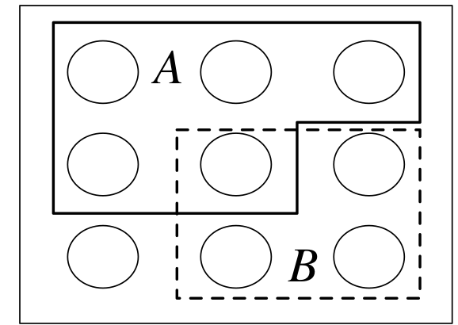
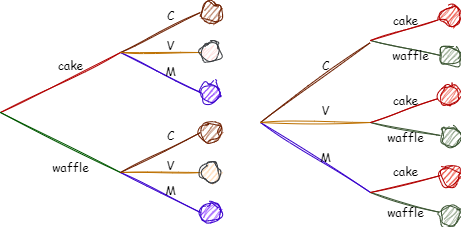
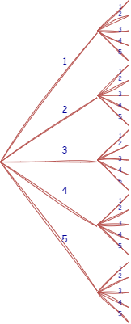
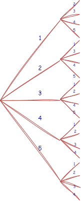
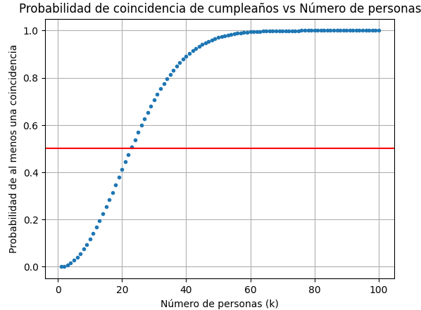

# Espacios muestrales y conteo 

## Espacios muestrales

::: {#muestral .definition name="Espacio muestral y evento"}
El *espacio muestral* $S$ de un experimento es el conjunto de todos los posibles resultados de un experimento. Un *evento* $A$ es un subconjunto del espacio muestral $S$ y se dice que $A$ *ocurrió* si el resultado actual pertenece a $A$
:::

[@blitzstein2019]

```{r echo=FALSE, out.width='30%', fig.cap="Un espacio muestral es como  un mundo de canicas con dos eventos $A$ y $B$", fig.align='center'}


```

El espacio muestral de un experimento puede ser finito o infinito contable o infinito incontable, cuando el espacio muestral es finito puede visualizarse como un mundo de canicas, como muestra la figura. Cada canica representa un resultado, y un evento es un conjunto de canicas. Realizar un experimento es equivalente a escoger una canica en forma aleatoria.

Por ejemplo, sea $S$ el espacio muestral de un experimento y sean $A$ y $B$ eventos. Entonces, la unión $A \cup B$ es el evento que ocurre si y solo si al menos uno de $A$ y $B$ ocurre, la intersección $A \cap B$ es el evento que ocurre si y solo si ambos $A$ y $B$ ocurren, y el complemento $A^c$ es el evento que ocurre si y solo si $A$ no ocurre. También tenemos las leyes de De Morgan:

\begin{equation}
(A \cup B)^c = A^c \cap B^c \textrm{ and } (A \cap B)^c = A^c \cup B^c
(\#eq:morgan)
\end{equation}


puesto que decir que no es el caso que al menos uno de $A$ y $B$ ocurra es lo mismo que decir que $A^c$ no ocurre y $B^c$ no ocurre, y decir que no es el caso que ambos ocurran es lo mismo que decir que al menos uno no ocurre. Resultados análogos se mantienen para uniones e intersecciones de más de dos eventos.

En el ejemplo mostrado en la Figura, $A$ es un conjunto de $n$ canicas, $B$ es un conjunto de $m$ canicas, $A \cup B$ consiste en los $n + m$ canicas en $A$ o $B$ (incluyendo el canicas que está en ambos), $A \cap B$ consiste en las canicas que está en ambos $A$ y $B$, y $A^c$ consiste en las $n$ canicas que no están en $A$.

En el ejemplo de la figura, $A$ es un conjunto de 5 canicas,$B$ es un conjunto de 4 canicas, $A \cup B$ es un conjunto de 8 canicas, incluyendo la que esta en los dos conjuntos, $A \cap B$ es un conjunto de 1 canica y $A^c$ consiste en cuatro canicas que no están en $A$

::: {#coins .example name="Espacio muestral y evento"}
Una moneda es lanzada 10 veces , se escribirá heads como $H$ y tails como $T$, un posible resultado es $HHHTHHTTHT$, el espacio muestral es el conjunto de todas las posibles cadenas de longitud 10 de $H's$ y $T's$.

Se puede codificar $H$ como $1$ y $T$ como $0$, asi que un resultado es una secuencia $(s_1,s_2,s_3, ..., s_{10}))$ con $s_j \in \{0, 1\}$, y el espacio muestral es el conjunto de todas esas secuencias.

Veamos ahora algunos eventos:

1.  Sea $A_1$ el evento en que la primer lanzamiento es Head

$$ A_1 = {(1,s_2, ...,s_{10}) }: s_j \in\ \{0,1\} , 2 \leq j  \leq  10$$

Este es un subconjunto del espacio muestral, o sea un evento, decir que $A_1$ ocurre es lo mismo que decir que el primer lanzamiento es Head. Similarmente se dice que $A_j$ es el evento en que el $j_{esimo}$ lanzamiento es Head, donde j =2,3,...,10.

2.  Sea $B$ el evento en el que al menos un lanzamiento fue head $$ B =   \bigcup_{j=1}^{10} A_j  $$

3.  Sea $C$ el evento en el que todos los lanzamientos fueron heads $$ C =   \bigcap_{j=1}^{10} A_j  $$

4.  Sea $D$ el evento en que hubo al menos dos Heads consecutivos

$$ C =   \bigcup_{j=1}^{9} ( A_j \cap A_{j+1} )   $$
:::

## Definicion ingenua de probabilidad (Naive definition of probability)

Históricamente, la definición de probabilidad de un evento fue contar el número de maneras en que evento puede suceder y dividir por el número total de resultados posibles del experimento.

::: {#definicioningenuaprobabilidad .definition name="Definición ingenua de probabilidad"}
Sea $A$ un evento para un experimento con un espacio muestral finito $S$ . la probabilidad ingenua de $A$ es


\begin{equation}
P_{naive} (A) = \frac{|A|}{|S|} = \frac { numero\, de\, resultados\, favorables\, de\, A}{total\, numero\, de\, resultados\, en\, S}
(\#eq:eqnaive)
\end{equation}


en donde $|A|$ es el tamaño (cardinalidad ) del conjunto $A$
:::

La definición ingenua es muy restrictiva en que esto requiere que $S$ sea finito, con igual masa para cada uno de las canicas por ejemplo. A a menudo es mal aplicado por personas que asumen resultados igualmente probables sin justificación y presentan argumentos en el sentido de " o sucederá o no sucederá y no sabemos cual, así que es 50-50". Por ejemplo, si no sabemos si hay vida en saturno ¿deberíamos concluir que es 50-50? ¿Que pasa con la vida inteligente en saturno, que parece que debería ser estrictamente menos probable que exista alguna forma de vida en saturno ? Sin embargo hay varios tipos importantes de problemas en los que la definición ingenua es aplicable, como cuando hay simetría en el problema, que hace que los resultados sean igualmente probables.[@blitzstein2019]

## Probabilidad y conteo

Calcular la probabilidad ingenua de un evento $A$ implica contar el numero de canicas en $A$ y el numero de canicas en el espacio muestral $S$. A menudo estos conjuntos con extremadamente grandes, por lo que podría ser tedioso o inviable contar las posibilidades uno a uno. Para abordar este desafío existen algunas técnicas de conteo.

::: {#reglamultiplicacion .theorem name="Regla de la multiplicación"}
Consideremos un experimento compuesto consistiendo en dos sub-experimentos, experimento $A$ y experimento $B$. supongamos que el experimento $A$ tiene $a$ posibles resultados y para cada uno de esos resultados el experimento $B$ tiene $b$ posibles resultados, entonces el experimento compuesto tiene $ab$ posibles resultados
:::

Imaginemos un diagrama como muestra la figura, consta de

::: {#ejemplomultiplicacion .example name="conos de helado"}
Supongamos que estamos comprando un helado en cono, se puede escoger entre un cake(pastel) o un waffle(oblea) y cada uno de ellos puede tener chocolate , vainilla o fresa como su sabor
:::

```{r echo=FALSE, out.width='80%', fig.cap="Diagrama de árbol para un cono de helado", fig.align='center'}


```

Por la regla de la multiplicación existen $2.3=3.2=6$ posibilidades. Pero debemos tener en cuenta algunas cosas como:

-   No importa si se elige primero el tipo de cono ( "quiero un cono de waffles con helado de chocolate" ) o el sabor ("Quiero un cono de chocolate en un cono de waffles"), de cualquier forma hay posibilidades.

-   No importa si los mismos sabores están disponibles en un cono de pastel que en un cono de oblea, Lo que importa es que hay exactamente tres opciones de sabor para cada opción de cono, si por algún motivo estuviese prohibido tener un sabor de chocolate en un cono de oblea por ejemplo ( y sin sustituto, ) , hay posibilidades pero la regla de multiplicación no aplicaría.

Podemos usar la regla de multiplicación para llegar a fórmulas de muestreo con y sin reemplazo. Muchos experimentos en probabilidad y estadística pueden interpretarse en un de estos dos contextos, por lo que es atractivo que ambas fórmulas seigan directamente el mismo principio básico de conteo.

::: {#muestreoconreemplazo .theorem name="Muestreo con reemplazo"}
Consideremos $n$ objetos y tomamos $k$ de ellos, una a la vez con reemplazo( es decir elegir un determinado objeto no impide que se elija nuevamente). entonces hay $n^k$ posibles resultados
:::

Por ejemplo, imaginemos que un frasco con $n$ canicas, etiquetadas del 1 a $n$, tomamos muestras de las bolas, una a la vez con reemplazo, lo que significa que cada vez que se elige una bola, se devuelve al frasco. Cada bola muestreada es un sub-experimento con $n$ posibles resultados, y hay $k$ sub-experimentos, entonces mediante la regla de multiplicación , hay $n^k$ formas de obtener una muestra de tamaño $k$

```{r echo=FALSE, out.width='30%',fig.cap="Muestreo con reemplazo cuando n=5 y k = 2", fig.align='center'}

```

::: {#muestreosinreemplazo .theorem name="Muestreo sin reemplazo"}
Consideremos $n$ objetos y tomamos $k$ de ellos, una a la vez sin reemplazo( es decir elegir un determinado objeto y se impide que se elija nuevamente). entonces hay $n(n-1) ... (n-k+1)$ posibles resultados , para $k \leq n$ y (0 posibilidades para $k>n$)
:::

```{r echo=FALSE, out.width='30%', fig.cap="Muestreo sin reemplazo cuando n=5 y k = 2", fig.align='center'}


```

El resultado es consecuencia directa de la regla de multiplicación: cada canica muestreada es otra vez un sub-experimento, y el número de posibles resultados decrece en uno (1) cada vez. Notemos que para muestrear $k$ de $n$ objetos sin reemplazo, necesitamos $k \leq n$, mientras que en el muestreo con reemplazo los objetos son inagotables.

::: {#permutaciones .example name="Permutaciones y factoriales"}
Una *permutación* de $1,2,...,n$ es una disposicion de ellos en algun orden, ej. $3,5,1,2,4$ es una permutación de $1,2,3,4,5$ por el teorema \@ref(thm:muestreosinreemplazo) con $k=n$ tendríamos que hay $n!$ permutaciones de $1,2,...,n$. Por ejemplo hay $n!$ maneras en las cuales $n$ personas pueden alinearse en una fila para comprar un helado
:::

Los teoremas \@ref(thm:muestreoconreemplazo) y \@ref(thm:muestreosinreemplazo) se refieren a *conteo*, pero cuando la definición de probabilidad ingenua aplica, podemos usarlos para calcular *probabilidades*

::: {#problemanacimiento .example name="Problema del nacimiento"}
Existen $k$ personas en un cuarto, asumimos que los cumpleaños de cada persona son igualmente probables para cualquiera de los $365$ días del año (se excluye febrero 29), y que los cumpleaños son independientes ( no hay gemelos en el cuarto), cual es la probabilidad que dos o mas personas en el grupo tengan la misma fecha de cumpleaños.
:::

**Solución** La definición de probabilidad ingenua dice que solo necesitamos contar el numero de formas para asignar cumpleaños a $k$ personas de tal forma que hay dos o mas personas comparten la misma fecha de cumpleaños. Este problema de conteo es un poco complejo, puesto que por ejemplo Emma y Steve comparten la fecha de cumpleaños, o Steve y Naomi o los tres juntos, o tres de ellos pueden compartir la fecha de cumpleaños, mientras otros dos en el grupo comparten fecha de nacimiento diferentes, o un monton de otras posibilidades.

En vez de eso, contemos el complemento: el numero de maneras para asignar cumpleaños a $k$ personas de tal forma que no haya dos personas que compartan un cumpleaños. Esto equivale a un muestreo de los 365 dias del año *sin* reemplazo, es decir para la primera persona, hay $365$ opciones para elegir el día del año de su cumpleaños, para la segunda persona, quedan 364 opciones, ya que no puede compartir el mismo día de cumpleaños con la primera persona. De manera similar, para la tercera persona quedan 363 opciones, puesto que no puede compartir el mismo día de cumpleaños con las dos primeras personas, de igual forma para la $k-esima$ persona hay $365-k+1$ opciones, por lo tanto el numero total de formas de asignar cumpleaños es por el teorema \@ref(thm:muestreosinreemplazo) de $365.364.363...(365-k+1)$ para $k \leq 365$

Sea $A$ el evento de obtener formas en que todas $k$ personas cumplen años en días diferentes, por tanto $|A|=365.364.363...(365-k+1)$

El total de formas posibles de asignar cumpleaños en el cuarto es $|S|=365^k$, a las $k$ personas, ya que cada persona puede tener su cumpleaños en cualquiera de los 365 días del año, de acuerdo al teorema \@ref(thm:muestreoconreemplazo)

por tanto :

$$P(A)=\frac{|A|}{|B|} =\frac{365.364.363...(365-k+1)}{365^k}  $$

$$P(A)=\frac{|A|}{|B|} =\frac{365.364.363...(365-k+1)}{365^k}  $$ Por tanto la probabilidad de que al menos una fecha de cumpleaños coincida es; $$1 - P(A) = 1- \frac{365.364.363...(365-k+1)}{365^k}  $$ La figura realizada con python dibuja la probabilidad de que al menos una fecha de cumpleaños concuerda como una funcion de $k$. con $k=23$ la probabilidad de coincidencia excede $0.5$, para $k=57$ la probabilidad es cercana al %99%

```{r echo=FALSE, out.width='60%', fig.cap="Probabilidad de  que en un cuarto de $k$ personas al menos dos nacen en el mismo día", fig.align='center'}

```

[Ver codigo fuente en python - probabilidades en funcion de \$k](#lbl_src_paradoja_cumpleanos-id)

**Etiquetar objetos**

Extraer una muestra de una población es un concepto muy fundamental en estadística, es importante pensar en los objetos o personas de la población como nombrados o etiquetados. Por ejemplo si hay $n$ bolas en un frasco, podemos imaginar que ellas tienen etiquetas desde $1$ a $n$, incluso si las bolas se ven iguales al ojo humano. A cada persona en el problema del cumpleaños , podemos darle un numero de identificación en lugar de pensar en las personas como partículas indistinguibles.

## Ajuste por sobreconteo (Adjusting or overcounting)

En muchos problemas de conteo, no es fácil contar directamente cada posibilidad una vez y solo una vez. Sin embargo si podemos contar cada posibilidad exactamente $c$ veces para algun $c$, entonce podemos ajustar dividiendo por $c$. Por ejemplo, si hemos contado exactamente dos veces cada posibilidad, podemos dividir por $2$ para obtener el conteo correcto.

::: {#comitesyequipos .example name="Comites y equipos"}
Consideremos un grupo de cuatro personas

(a) cuantas maneras hay de escoger un comité de dos personas

(b) cuantas maneras hay de dividir las personas en dos equipos de dos.
:::

**Solución**

(a) Una manera de contar las posibilidades es listar las personas etiquetándolas como 1,2,3,4 entonces las posibilidades son\

    {1,2},{1,3},{1,4},{2,3},{2,4},{3,4}\

    otra aproximación es usar la regla de multiplicación con un ajuste por sobreconteo. Por la regla de multiplicación hay $4$ formas de escoger la primera persona y $3$ maneras de escoger la segunda persona en el comité, pero esto cuenta cada posibilidad dos veces , como escoger las personas $1$ y $2$ es lo mismo que escoger las personas $2$ y $1$ tenemos un sobreconteo por un factor de $2$ , el numero de posibilidades es $(4.3)/2=6$

(b) hay $3$ maneras de formar los equipos\
    posibilidad 1 {1,2},{3,4}\

    posibilidad 2 {1,3},{2,4}\

    posibilidad 3 {1,4},{2,3}\

    Listar todas las posibilidades puede ser tedioso o inviable con mas personas\

    Una segunda forma es fijar el compañero 1 del equipo de la persona 1 y luego determinar el otro equipo.

    Otra forma es que sabemos en la solución (a) que hay $6$ formas de escoger un equipo. escoger {1,2} para formar un equipo es lo mismo que escoger {3,4} para formar los dos equipos, así que la respuesta es $6/2=3$

Existe un coeficiente llamado *coeficiente binomial* que cuenta el numero de subconjuntos de cierto tamaño para un conjunto , tal que el numero de formas de escoger un comité de tamaño $k$ de un conjunto de $n$ personas. Los conjuntos y los subconjuntos son por definición no ordenados es decir {3,1,4}= {4,1,3}, así que lo que contamos es el numero de maneras de escoger $k$ objetos de $n$ sin reemplazo y sin distinguir entre los diferentes ordenes

::: {#coeficientebinomial .definition name="Coeficiente binomial"}
Para cualquier enteros no negativos $k$ y $n$, el coeficiente binomial $\binom{n}{k}$, se lee *combinatoria de* $n$ en $k$ o *n choose k* es el número de subconjuntos de tamaño $k$ para un conjunto de tamaño $n$ sin importar el orden
:::

::: {#formulacoeficientebinomial .theorem name="Formula del coeficiente binomial"}
para $n$ y $k$ enteros no negativos y $k \leq n$ 


\begin{equation} 
  \binom{n}{k} = \frac{ n(n-1) ...(n-k+1)}{k!} = \frac{n!}{(n-k)!k!}
  (\#eq:eqcoeficientebinom)
\end{equation} 

si $k>n$ 


\begin{equation} 
  \binom{n}{k} = 0 
  (\#eq:eqcoeficientebinom0)
\end{equation} 


:::

Prueba: sea $A$ un conjunto con $|A|=n$ cualquier subconjunto de $A$ tiene un maximo de $n$ elementos así que $\binom{n}{k} = 0$

El teorema \@ref(thm:muestreosinreemplazo) dice que hay $n(n-1) ...(n-k+1)$ maneras de realizar una escogencia ordenada de $k$ elementos sin reemplazo Esto cuenta en exceso cada subconjunto de interés por un factor de $k!$ (ya que no nos importa cómo se ordenan estos elementos), por lo que podemos obtener el conteo correcto dividiendo por $k!$


::: {#cluboficiales .example name="Club de oficiales"}
en un club de $n$ personas , hay $n(n-1)(n-2)$formas de escoger un presidente, vicepresidente y tesorera, por tanto hay 
$\binom{n}{3} = \frac{ n(n-1)(n-2)}{3!}$ formas de escoger 3 oficiales sin títulos predeterminados.
:::

::: {#permutacionespaalabra .example name="Permutaciones de una palabra"}
Cuantas formas diferentes existen para permutar la palabra LALALAAA?  para determinar una permutación  necesitamos escoger  como colocar las 5 letras A  en ocho slots disponibles o en forma equivalente escoger donde pueden ir las 3 L's

  
:::

Solución

$$\binom{8}{5} =\binom{8}{3} = \frac{ 8.7.6}{3!} = 56\text{ permutaciones}$$ 

::: {#fullhouse .example name="Full house en poker"}
Una mano de 5 cartas es repartida desde una baraja  estandar de 52 cartas, la mano es llamada un __full house_ si este consiste en tres cartas del mismo rango y  dos cartas de otro rango, ejemplo tres 7's y dos 10's (en cualquier orden), cual es la probabilidad de un full house?

Hay   $\binom{52}{5}=2598960$ posibles manos ,  igualmente probables por simetría, asi que es aplicable la definición de probabilidad ingenua. 

Para encontrar  el numero de manos de full  house usamos la regla de multiplicación,  Hay $13$ rangos de cartas de una baraja  por lo que hay $\binom{13}{1}=13$  de elegir un rango del trio y $\binom{12}{1}$ formas de elegir el rango del par necesario, este rango debe ser diferente al trio  ,

Para el primer rango hay $\binom{4}{3}$ formas de seleccionar tres cartas de ese rango  y $\binom{4}{2}$  formas de escoger las dos cartas  del otro rango

Por tanto tenemos un total de posibles formas de obtener fullhouse de 

$$\binom{13}{1} \binom{4}{3} \binom{12}{1} \binom{4}{2}  =3744$$
Por tanto si $F$ es el evento de  obtener un full house tenemos 

$$P(F) = 3744/2598960 ≈ 0.0014405762304921968≈0.144\% $$
:::


**Nota: **

Una baraja de poker estándar consta de 52 cartas divididas en cuatro palos: corazones (hearts), diamantes (diamonds), tréboles (clubs) y picas (spades). Cada palo contiene 13 cartas numeradas del 2 al 10, y luego tres cartas de figura: el Jack (J), la Reina (Q) y el Rey (K), junto con el As (A).

Por lo tanto, las 52 cartas de una baraja de poker estándar son:

Corazones (Hearts):\

A de corazones (A♥)\
2 de corazones (2♥)\
3 de corazones (3♥)\
4 de corazones (4♥)\
5 de corazones (5♥)\
6 de corazones (6♥)\
7 de corazones (7♥)\
8 de corazones (8♥)\
9 de corazones (9♥)\
10 de corazones (10♥)\
J de corazones (J♥)\
Q de corazones (Q♥)\
K de corazones (K♥)\

Diamantes (Diamonds):\

A de diamantes (A♦)\
2 de diamantes (2♦)\
3 de diamantes (3♦)\
4 de diamantes (4♦)\
5 de diamantes (5♦)\
6 de diamantes (6♦)\
7 de diamantes (7♦)\
8 de diamantes (8♦)\
9 de diamantes (9♦)\
10 de diamantes (10♦)\
J de diamantes (J♦)\
Q de diamantes (Q♦)\
K de diamantes (K♦)\

Tréboles (Clubs):\

A de tréboles (A♣)\
2 de tréboles (2♣)\
3 de tréboles (3♣)\
4 de tréboles (4♣)\
5 de tréboles (5♣)\
6 de tréboles (6♣)\
7 de tréboles (7♣)\
8 de tréboles (8♣)\
9 de tréboles (9♣)\
10 de tréboles (10♣)\
J de tréboles (J♣)\
Q de tréboles (Q♣)\
K de tréboles (K♣)\

Picas (Spades):\
A de picas (A♠)\
2 de picas (2♠)\
3 de picas (3♠)\
4 de picas (4♠)\
5 de picas (5♠)\
6 de picas (6♠)\
7 de picas (7♠)\
8 de picas (8♠)\
9 de picas (9♠)\
10 de picas (10♠)\
J de picas (J♠)\
Q de picas (Q♠)\
K de picas (K♠)\

Estas son las 52 cartas en una baraja de poker estándar.


::: {#escogiendocomplemento .example name="Escogiendo el complemento"}
Para cualquier $n,k$ enteros positivos con $k \leq n$

$$\binom{n}{k}= \binom{n}{n-k}$$
:::


consideremos un comité  de $n$ personas de las cuales se escoge un equipo de $k$ personas, ya sabemos que existen  $\binom{n}{k}$  posibilidades , pero otra forma de conocer la cantidad posibilidades es buscar las $n-k$ personas que no estan en el comité


::: {#elcapitandelequipo .example name="El capitán del equipo"}
Para cualquier $n,k$ enteros positivos con $k \leq n$

$$n\binom{n-1}{k-1}= k\binom{n}{k}$$
:::

En forma sencilla  consideremos un grupo de $n$ personas de las cuales se escoge un equipo de $k$ personas, uno de ellos podría ser el capitán del equipo.
Inicialmente podemos  escoger el capitán del equipo y el resto  $k-1$ como miembros del equipo. Equivalente a esto podríamos escoger primero  los $k$ miembros del equipo y luego escoger uno de ellos como el capitán


::: {#identidaddevandermondes .example name="Identidad de vandermonde's"}
Para cualquier $n,k$ enteros positivos con $k \leq n$

$$\binom{m+n}{k}= \sum_{j=0}^{k}\binom{m}{j}\binom{n}{k-j} $$
:::

Consideremos un conjunto de $m$ pavos reales y $n$ tucanes, de los cuales se puede seleccionar un conjunto de $k$ aves , hay entonces $\binom{m+n}{k}$  posibilidades para el conjunto de aves.  Si hay $j$ pavos reales en el conjunto entonces debe de haber $k-j$ tucanes en el mismo conjunto.  El lado derecho de la identidad suma todos los casos posibles.


::: {#dividirpersonas .example name="Dividir 12 personas en 3 equipos"}
Cuántas formas hay de dividir una docena de personas en 3 equipos, donde un equipo tiene 2 personas y los otros dos equipos tienen 5 personas cada uno?

$$\frac{\binom{12}{2}\binom{10}{5}\binom{5}{5}}{2}=8316$$
:::
La división por 2 es porque por ejemplo, si las personas se nombran como ['A', 'B', 'C', 'D', 'E', 'F', 'G', 'H', 'I', 'J', 'K', 'L']

el primer equipo puede estar conformado por 
A	 B
el segundo equipo puede estar conformado por 
C, D, E, F, G
el tercer equipo puede estar conformado por
H, I, J, K, L

Pero una posible combinación del segundo equipo puede ser también
H, I, J, K, L

y en el tercer equipo esta formado por
C, D, E, F, G


::: {#dividirpersonas1 .example name="Dividir 12 personas en 3 equipos de 4 personas"}
Cuántas formas hay de dividir una docena de personas en 3 equipos, donde un equipo tiene 4 personas?

$$\frac{\binom{12}{4}\binom{12}{4}\binom{12}{4}}{3!}=5775$$
:::


::: {#dividirpersonas1 .example name="suma  de combinatorias"}
Demostrar 

$$\binom{n}{k} + \binom{n}{k-1} = \binom{n+1}{k}$$
o lo que es lo mismo 

$$ \binom{n}{k} +\binom{n}{k+1}  = \binom{n+1}{k+1}$$
:::


::: {#problemacifrastelefonicas1 .example name="telefono de 7 digitos"}
Cuántos números de teléfono de 7 dígitos son posibles, teniendo en cuenta que la primera cifra no puede iniciar con 0 o 1

$8*10*10*10*10*10*10=8000000$

:::


::: {#problemacifrastelefonicas2 .example name="telefono de 7 digitos"}
Cuántos números de teléfono de 7 dígitos son posibles, pero esta vez no puede iniciar con 911

Existen $10^4$ posibles valores que inician con $911$ , basta con fijar el 911 y quedan $4$ cifras usando la regla de multiplicación

Por otro lado hay $8000000$ de combinaciones que no inician ni con 0 ni con 1

Por tanto el numero de combinaciones posibles es

$$8000000-10000=7990000$$
:::


::: {#partidasdeajedrez .example name="partidas de ajedrez"}
Dos ajedrecistas, A y B, van a jugar 7 partidas. Cada juego tiene tres resultados posibles: una victoria para A (que es una derrota para B), un empate (empate) y una derrota para A (que es una victoria para B). Una victoria vale 1 punto, un empate vale 0.5 puntos y una derrota vale 0 puntos.

¿Cuántos resultados posibles hay para los juegos individuales, de modo que el jugador A en general termine con 3 victorias, 2 empates y 2 derrotas?

Una forma de resolverlo es imaginando $7$ posiciones  y por tanto se pueden acomodar en esas 7 posiciones $\binom{7}{2}$ empates, en las otras 5 posiciones podemos acomodar $\binom{5}{3}$ victorias y en las ultimas 2 posiciones podemos acomodar $\binom{2}{2}$  para un total de posibilidades de  

$$\binom{7}{2} \binom{5}{3} \binom{2}{2}= 210$$

otra forma de resolverlo es con el _coeficiente binomial_ (se puede usar cuando se necesita partir un grupo de $n$ objetos en tres o mas  grupos ) equivale a : 7 (7!) total de juegos en grupos de 3 ($3!$) y dos grupos de dos (2!) (2!)

$$\frac{7!}{3!2!2!}=210$$
¿Cuántos resultados posibles hay para los juegos individuales, de modo que A termine con 4 puntos y B termine con 3 puntos?

tenemos estas posibilidades para que A termine con 4 puntos y B termine con tres puntos

WDDDDDD
WWDDDDL
WWWDDLL
WWWWLLL

W es partido ganado, D partido empatado y L partido perdido

$$\frac{7!}{1!6!} + \frac{7!}{2!4!1!} + \frac{7!}{3!2!2!}   + \frac{7!}{4!3!} = 357$$

:::


::: {#ascensor .example name="ascensor"}
Tres personas se suben a un ascensor vacío en el primer piso de un edificio que tiene pisos. Cada uno presiona el botón del piso deseado (a menos que uno de los otros ya haya presionado ese botón). Suponga que es igualmente probable que quieran pasar por los pisos (independientemente el uno del otro). ¿Cuál es la probabilidad de que se presionen los botones de pisos consecutivos?

_Solucion:_
El numero total de posibles resultados descartando el 1 es $9^3$ 

Hay 7 posibilidades por parte de las personas de subir a pisos consecutivos (2,3,4), (3,4,5), (4,5,6), (5,6,7), (6,7,8), (7,8,9), (8,9,10) y por cada una de esas posibilidades, las personas pueden escoger $3!$ maneras,  La definición de probabilidad ingenua entonces nos dice que la probabilidad es:

$$\frac{7*3!}{9^3}=0.057613169$$


:::


::: {#cumpleanosenenero .example name="cujple años en"}
La probabilidad de que tres personas en un grupo de tres nazcan en enero 1 es  mayor , menor o igual que la probabilidad de que en un gruṕo de tres personas una nace en enero 1, otra nace en enero 2 y otra nace en enero 3

_Solucion:_
El numero total de posibles resultados es $365^3$ 

Hay una sola posibilidad en que tres personas nazcan el día 1 de enero , por tanto la probabilidad de que nazcan el día 1 de enero es : $$\frac{1}{365^3} $$

Hay $3!$ posibilidades de que una persona del grupo nazca el día 1 , otra el dia 2 y otra el dia 3 por tanto la probabilidad es  $$\frac{6}{365^3} $$

Por tanto La probabilidad de que tres personas en un grupo de tres nazcan en enero 1 es  _menor_ que la probabilidad de que en un grupo de tres personas una nace en enero 1, otra nace en enero 2 y otra nace en enero 3
:::

