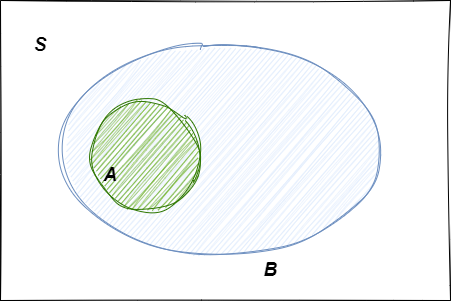
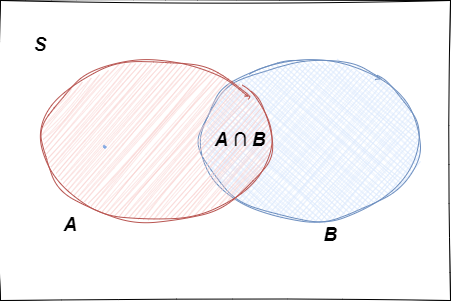

# Probabilidad

## Definición general de Probabilidad

Hasta ahora se ha revisado varios métodos para contar los resultados en un espacio muestral, lo que permite calcular probabilidades aplicando la definición ingenua. Pero la definición ingenua solo puede llevarnos hasta cierto punto, ya que se requieren resultados igualmente probables y no puede manejar un espacio muestral infinito. Ahora se muestra la definición general de probabilidad

::: {#definiciongeneraldeprobabilidd .definition name="Definición general de  probabilidad"}
Un *espacio de probabilidad* consiste en un *espacio muestral* $S$ y una *función de probabilidad* $P$ el cual toma un evento $A \subseteq S$ como entrada y retorna $P(A)$, un número real entre $0$ y $1$, como salida, la función $P$ debe satisfacer los siguientes axiomas:

1.  Probabilidad de evento nulo y espacio muestral

```{=tex}
\begin{equation} 
  P(\emptyset)=0,P(S)=1
  (\#eq:probabilidadvacioyespacio)
\end{equation}
```
2.  Si $A_1, A_2, A_3, ...$ son eventos disjuntos , entonces

```{=tex}
\begin{equation} 
  P\left(\bigcup_{j=1}^{\infty} A_j\right)=\sum_{j=0}^{k} P(A_j)
  (\#eq:probabilidaddisjuntos)
\end{equation}
```
Decimos que esos eventos son disjuntos significa que ellos son mutuamente excluyentes: $A_i \cap A_j = \emptyset, \quad \text{para } i \neq j$
:::

En el mundo de las canicas, la definición dice que la probabilidad se comporta como la masa: La masa de una pila vacía de canicas es $0$, la masa total de todas las canicas es $1$ , y si tenemos pilas de canicas que no se superponen, podemos obtener su masa combinada sumando las masas de las pilas individuales. A diferencia del caso ingenuo, ahora podemos tener canicas de diferentes masas y también podemos tener un numero infinito numerable de canicas siempre que su masa total es $1$

Cualquier función $P (\text{mapeo de eventos a numeros  en el intervalo [0,1])}$ que satisface los dos axiomas es considerada un funcion valida de probabilidad, sin embargo, los axiomas no dicen como debe ser interpretada la probabilidad

La visión *frecuentista* de probabilidad es que representa una frecuencia a largo plazo durante un gran número de repeticiones de un experimento: si decimos que una moneda tiene probabilidad de $1/2$ de obtener una cara, significaría que la moneda arrojaría caras el 50% de las veces si las tiráramos una y otra vez.

La visión *Bayesiana* de probabilidad representa un grado de creencia sobre el evento en cuestión, por lo que podemos asignar probabilidades a hipótesis como "el candidato A podría ganar la elección" o "el acusado es culpable", incluso si no es posible repetir la misma elección o el mismo crimen una y otra vez.

Las perspectivas Bayesiana y frecuentista con complementarias y ambas se ayudan, Independientemente de como elijamos interpretar la probabilidad, podemos usar los dos axiomas para derivar otras propiedades de la probabilidad, y estos resultados se mantendrán para cualquier función de probabilidad válida.

::: {#propiedadesprobabilidad .theorem name="Propiedades de la probabilidad"}
La probabilidad tiene los siguientes propiedades para cualquier evento A y B

1.  

```{=tex}
\begin{equation} 
  P(A^c)=1 - P(A)
  (\#eq:probabilidadcomplemento)
\end{equation}
```
2.  Si $A \subseteq B$, entonces

```{=tex}
\begin{equation} 
 P(A) \leq P(B)
  (\#eq:probabilidadsubconjunto)
\end{equation}
```
3.  

```{=tex}
\begin{equation} 
 \text{P}(A \cup B) = \text{P}(A) + \text{P}(B) - \text{P}(A \cap B)
  (\#eq:probabilidadunion)
\end{equation}
```
:::

**Demostración 1**

Puesto que $A$ y $A^c$ son disjuntos, $S = A \cup A^c$ y por el segundo axioma tenemos

$$P(S) = P (A) + P(A^c) $$ Pero como $P(S)=1$

$$P (A) + P(A^c) = 1$$

**Demostración 2**

Si $A \subseteq B$, tenemos que $$B = ( A \cap B) \cup (B-A)= A \cup (B-A)$$ El axioma 2 nos dice que $P(B) = P(A)+ P(B-A)$ Así $P(B-A) \geq 0 => P(A) \leq P(B)$


```{r echo=FALSE, out.width='52%', fig.cap="cuando A es subconjunto de  B", fig.align='center'}


```

**Demostración 3**

$$A \cup B = (A-B) \cup (B-A) \cup (A \cap B)$$


```{r echo=FALSE, out.width='52%', fig.cap="cuando A es subconjunto de  B", fig.align='center'}


```


Por tanto $$P(A \cup B)= P(A-B)+P(B-A) +P(A \cap B)$$ Puesto que $$A = ( A \cap B ) \cup (A-B),B = ( A \cap B ) \cup (B-A)$$ obtenemos $$P(A) = P(A \cap B) + P(A-B), P(B) = P(A \cap B) + P(B-A) $$ Y con un par de reemplazos obtenemos \@ref(eq:probabilidadunion)


::: {#inclusionexclusion .theorem name="Principio de inclusión - exclusión"}
Sea $A_1, A_2, ..., A_n \in S$ entonces

\begin{equation}
P\left(\bigcup_{k=1}^{n}A_k\right)=\sum_{k=1}^{n} P(A_k) - \sum_{k_1<k_2}^{n}\text{P}(A_{k_1} \cap A_{k_2}) + \\ \sum_{k_1<k_2<k_3}^{n}\text{P}(A_{k_1} \cap A_{k_2} \cap  A_{k_3})+...+ \\ (-1)^{n+1}P\left(\bigcap_{k=1}^{n}A_k \right) 
 (\#eq:inclusionexclusion)
\end{equation}
:::
  
  
::: {#ejemplomontmorts .example name="el problema de las cartas de Montmort's"}
Consideremos una baraja de $n$ cartas bien barajada, etiquetadas de $1$ hasta $n$, volteamos la carta  una por una, diciendo los num eros desde $1$ hasta $n$, se gana el juego   si en algún momomento, el numero que se dioce en voz alta es el mismo que el número de la carta que se esta volteando ( por ejemplo, si la 7ma carta del mazo tiene la etiqueta 7), ¿cuál es la probabilidad de ganar?
:::

**Solucion**
Sea $A_i$ el evento en que la carta $i$esima en la baraja tiene el numero $i$ escrito, estamos entonces interesados en la probabilidad  de la union $A_1 \cup A_2 \cup ... \cup  A_n$ , se gana el juego si  al menos una de las cartas tiene el número que coincida con su posición en el mazo. (Un pedido por el que pierdes de llama _trastorno mental_, aunque es de esperar que nadie se  haya trastornado nunca debido a perder en este juego)

$$P(A_i)=\frac{1}{n}$$ para $i <= n$ puesto que hay $n$ cartas  y la probabilidad de obtener la carta $i$ es $\frac{1}{n}$

Otra forma de ver esto es usando el espacio muestral completo es decir  hay $n!$ posibles formas de ordenar  la baraja, todas igualmente probables , y $(n-1)!$ de esas  son  favorables a $A_i$ (se fija la carta numerada $i$ en la posición $i$ es una en la baraja y entonces todas las restantes cartas pueden estar en cualquier orden)

$$P(A_i \cap A_j) = \frac{(n-2)!}{n!}= \frac{1}{n(n-1)}$$ 
Puesto que se requiere que las cartas numeradas $i$ y $j$ estén la $i$ y $j$ posición en la baraja  y  por tanto las $n-2$ cartas puedan estar en cualquier orden, por tanto $(n-2)!$ de las  $n!$ son favorables a $P(A_i \cap A_j)$ 

Similarmente 

$$P(A_i \cap A_j  \cap A_k ) = \frac{(n-3)!}{n!}= \frac{1}{n(n-1)(n-2)}$$ 
Y el patrón continua por intersecciones de 4 eventos

En la fórmula de inclusión-exclusión, hay $n$ términos involucrando un evento , $\binom{n}{2}$ términos involucrando dos eventos , $\binom{n}{3}$ términos involucrando tres eventos , y así sucesivamente.

$$P\left(\bigcup_{i=1}^{n}A_i\right)=\frac{n}{n}-\frac{\binom{n}{2}}{n(n-1)} + \frac{\binom{n}{3}}{n(n-1)(n-2)}-...+(-1)^{n+1}\frac{1}{n!} \\ 
=1-\frac{1}{2!}+\frac{1}{3!}-...+(-1)^{n+1}\frac{1}{n!}
$$
La serie de Taylor nos dice:
$$e^{-1}=1-\frac{1}{1!}+\frac{1}{2!}-\frac{1}{3!}+...,$$
de lo cual 
$$1-e^{-1}=\frac{1}{1!}-\frac{1}{2!}+\frac{1}{3!}+...,$$

reemplazando 

$$P\left(\bigcup_{i=1}^{n}A_i\right)=1 - \frac{1}{e}$$
Así que para grandes $n$ la probabilidad de ganar el juego es extremadamente cercana a $1-\frac{1}{e} ≈ 0.63$

A die is a cube whose 6 sides are labeled with the integers from 1 to 6. The die is fair if all 6 sides are equally likely to come up on top when the die is rolled. The plural form of "die" is "dice".


::: {#dividirpersonas1 .example name="suma  de combinatorias"}
Sabemos que un dado es un cubo de 6 caras  etiquetadas del 1 al 6.  El dado es  justo si todas las caras tienen igual probabilidad de salir  cuando el dado es tirado
Cual es la probabilidad es maayor, que  después de lanzar 4 dados la suma de sus caras es 21 o  la probabilidad de que después de lanzar 4 dados la suma de las caras es 22

Para obtener 21 solo tenemos las siguientes posibilidades 
$(6,6,6,3)$ 4 posibilidades
$(5,5,5,6)$ 4 posibilidades
$(6,6,5,4)$ 12 posibilidades después de permutar

Para un total de 20 posibilidades


Y  para obtener 22  debemos permutar
$(6,6,5,5)$  6 posibilidades
$(6,6,6,4)$  4 posibilidades

Para un total de 10 posibilidades

Por tanto  la probabilidad de obtener 21 es mas grande que la posibilidad de obtener 22
:::


::: {#capturarecaptura .example name="captura-recaptura"}
Los alces habitan en un cierto bosque, hay $N$ alces de los cuales   se captura una muestra aleatoria de tamaño $n$ , los alces capturados se retornan a la población y se toma una nueva muestra , esta vez de tamaño $m$, este método es conocido en ecología como captura-recaptura.  Cual es la probabilidad de que exactamente $k$ de los $m$ alces en la nueva muestra sea tomada otra vez. 

$$P(X = k) = \frac{\binom{n}{k}\binom{N-n}{m-k} }{\binom{N}{m}}$$
Donde:\\

$\binom{n}{k}$ es el número de formas de elegir $k$ alces de la primera muestra de tamaño $m$\\

$\binom{N-n}{m-k}$ es el número de formas de elegir $m-k$ alces que no fueron capturados en la primera muestra  de los $N-n$  alces restantes de la población\\

$\binom{N}{m}$ es el número de formas de elegir $m$ alces de la población total de  $N$ alces\\

Esto se conoce como la probabilidad hypergeométrica
:::


