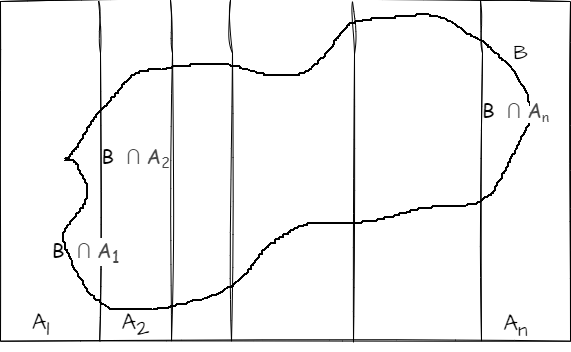

# Probabilidad condicional
El condicionamiento es una estrategia de resolución de problemas muy poderosa, que a menudo permite resolver un problema complicado descomponiéndolo en partes manejables con un razonamiento caso por caso. Debido a la importancia central del condicionamiento, decimos que el condicionamiento es el alma de las estadístic

## Definición de Probabilidad condicional

::: {#probabilidadcondicional .definition name="Definicion de probabilidad condicional"}

si $A$ y $B$ son eventos con $P(B)>0$ entonces la probabilidad condicional de $A$ dado $B$ denotado por $P(A|B)$ se define como :


\begin{equation}
P(A|B)=\frac{ P(A \cap B)}{P(B)}
(\#eq:conditional)
\end{equation}

:::
Aquí $A$ es el evento cuya incertidumbre queremos actualizar y $B$ es la evidencia que observamos (o queremos tratar como dada). LLamamos $P(A)$ la probabilidad _a priori_ de $A$  y $P(A|B) la probabilidad _a posteriori_ de A ( _a priori_  antes de actualizar basada en el evidencia y _a posteriori_ significa después de actualizar basada en la evidencia).  


::: {#condicionaltwocardas .definition name="Dos cartas"}
Una baraja estándar de 52 cartas se baraja bien, se extraen dos cartas aleatoriamente, una a la vez sin reemplazo. Sea $A$ el evento en que la primera carta es un corazón, y $B$ el evento en que la segunda carta es roja.  Encontrar $P(A|B)$ y $P(B|A)$
:::

**solucion**

$$P(A \cap B)=\frac{13.25}{52.51}=\frac{25}{204}$$
$$P(A)=13/52=1/4$$
$$P(B)=(26/52).(51/51)=1/2$$
por tanto $$P(A|B)= \frac{ P( A \cap B)}{P(B)}=\frac{25/204}{1/2}=25/102$$
$$P(B|A)= \frac{ P( A \cap B)}{P(A)}=\frac{25/204}{1/4}=25/51$$


## Regla de bayes y probabilidad total

::: {#probabilidadinterseccion .theorem name="Probabilidad de la intersección de dos eventos"}

para cualquier par de eventos $A$ y $B$ con probabilidades positivas


\begin{equation} 
  P( A \cap B) =P(B)P(A|B) = P(A)P(B|A)
  (\#eq:interseccioneventos)
\end{equation} 


:::


::: {#probabilidadinterseccionneventos .theorem name="Probabilidad de la intersección de n eventos"}
Para cualquier  eventos $A_1,...,A_n$ con probabilidades positivas

\begin{equation} 
  P( A_1, A_2, A_3,...,A_n) =P(A_1)P(A_2|A_1)P(A_3|A_1,A_2)...P(A_n|A_1,...,A_{n-1})
  (\#eq:interseccionneventos)
\end{equation} 

Las comas representan int

ersecciones. Por ejemplo $P(A_3|A_1,A_2)$ es la probabilidad de que ocurra $A_3$ dado que ambos $A_1$ y $A_2$ ocurran.
:::

::: {#regladebayes .theorem name="Regla de Bayes"}
para cualquier par de eventos $A$ y $B$ con probabilidades positivas

\begin{equation} 
  P( A|B) =\frac{P(B|A)P(A)}{P(B)}
  (\#eq:eqregladebayes)
\end{equation} 
:::


::: {#lotp .theorem name="Ley de la probabilidad total"}
sea $A_1,...,A_n$ partición del espacio muestral $S$ , los $A_i$ son eventos disjuntos y $\bigcup_{i=1}^{n}A_i=S$


\begin{equation} 
  P( B) =\sum_{i=1}^{n}P(B|A_i)P(A_i)
  (\#eq:eqlotp)
\end{equation} 
:::

**Demostracion**
Puesto que $A_i$ forman particiones de $S$, podemos descomponer $B$ como 
$$B=(B \cap A_1) \cup  (B \cap A_2) \cup ...\cup (B \cap A_n)  $$ 
Por tanto 

$$P(B)=P(B \cap A_1) + ... + P (B \cap A_n)=P(B/A_1)P(A_1)+...+P(B/A_n)P(A_n)$$
```{r echo=FALSE, out.width='60%', fig.cap="Particion $A_i$", fig.align='center'}


```


::: {#monedaaleatoria .example name="moneda aleatoria"}
Tenemos una moneda justa y otra moneda sesgada en la cual sale cara con  probabilidad de $3/4$ , se elige una moneda al azar y se tira tres veces.  Si se obtiene cara las tres veces , cual es la probabilidad de que la moneda elegida sea la justa?
:::

**Solución**

Sea $A$ el evento en que la moneda escogida  se obtiene cara tres veces y sea $F$ el evento en que elegimos la moneda justa, por tanto estamos interesados en la $P(F|A)$, es más fácil  encontrar P(A|F)
\begin{align*}
P(F|A) &= \frac{P(A|F) P(F)}{P(A)} \\
	&= \frac{P(A|F) P(F)}{P(A|F) P(F) + P(A|F^c) P(F^c)} \\
	&= \frac{(1/2)^3 \cdot 1/2}{(1/2)^3 \cdot 1/2 + (3/4)^3 \cdot 1/2} \\
	&\approx 0.23.
\end{align*}


::: {#monedaaleatoria .example name="moneda aleatoria"}
Jimmy esta siendo pruebas diagnosticas para saber si tiene la enfermedad llamada condicionitis, una condición médica que aflige al $1\%$ de la población, su resultado es positivo, es decir , el test afirma que Jimmy tiene la enfermedad. Sea $D$ el evento en que Jimmy tiene la enfermedad , sea $T$ el evento que el es positivo.

Supongamos que los test tienen una precisión del $95\%$ es decir asumimos en esta problema que $P(T|D)=0.95$ y $P(T^c|D^c)=0.95$ la cantidad de $P(T|D)$ se conoce como  la _sensitividad_  o _tasa de verdadero positivo_ de la prueba y $P(T^c|D^c)$ es conocida como la _especificidad_ o _$$_tasa de verdaderos negativos_ de la prueba.

Encontrar la probabilidad de que  Jimmy tiene _condicionitis_ dado el resultado provisto por la prueba.

:::

**Solución**

Queremos hallar $P(D|T)$ 
\begin{align*}
 P(D|T) &= \frac{P(T|D)P(D)}{P(T)} \\
 &= \frac{P(T|D)P(D)}{P(T|D)P(D) + P(T|D^c)P(D^c) } \\
 &= \frac{0.95 . 0.01}{ 0.95.0.01 + 0.05*0.99 } \\
 &\approx 0.16
 
\end{align*}

Por tanto  hay 16% de que Jimmy tenga la enfermedad, dado que el resultado es positivo, aunque la prueba parece ser confiable.

A muchas personas les sorprende que la probabilidad condicional de tener la enfermedad con un resultado positivo en la prueba sea de solo el 16%, a pesar de que la prueba tiene una precisión del 95%. La clave para comprender esta probabilidad posterior sorprendentemente alta es darse cuenta de que hay dos factores en juego: la evidencia de la prueba y nuestra información previa sobre la prevalencia de la enfermedad. La probabilidad condicional refleja un equilibrio entre estos dos factores, sopesando adecuadamente la rareza de la enfermedad frente a la rareza de los resultados erróneos de una prueba.


